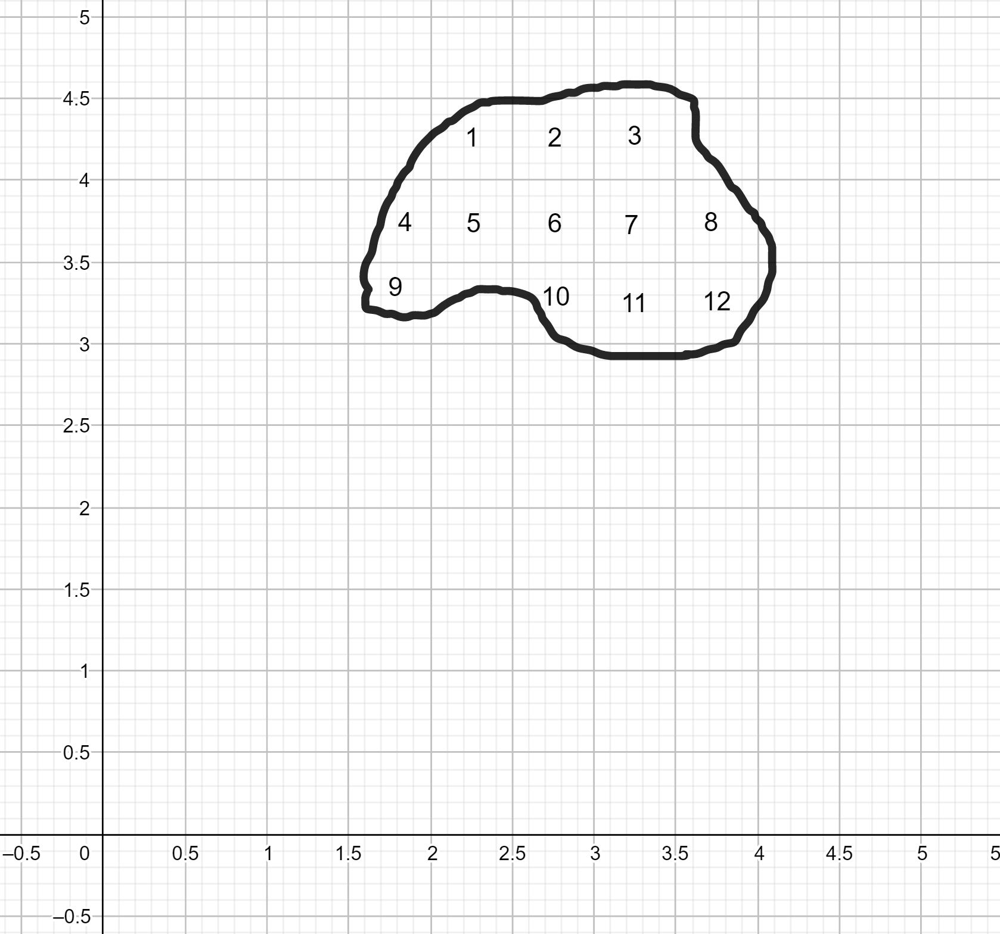
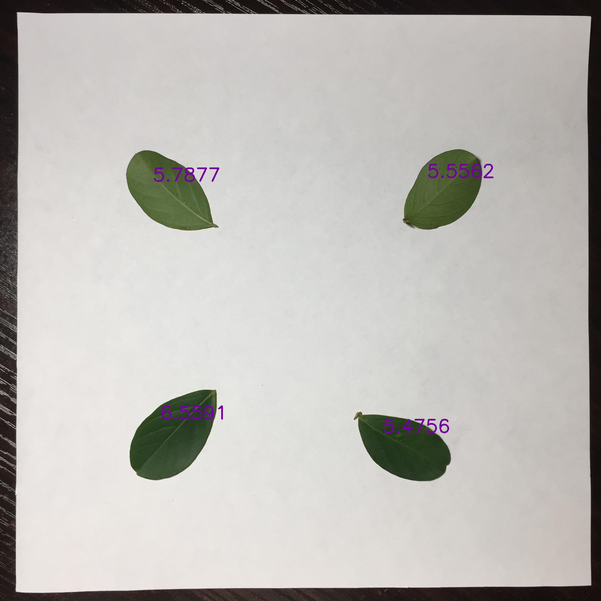

我们小学二年级就学过，估计树叶的面积要用方格纸，通过数格子来估计不规则物体的面积。但实际的野外实习和工作中，即使你找来了方格纸，这个办法也既笨拙又不精准。那怎样才能更精准快速地估计树叶面积呢？

## 1 回顾小学二年级的方格纸方法
如果要计算一不规则形状的面积，我们可以把它放在一个可度量方格纸上，比如每个格子的面积都是 $0.25$ 平方厘米。然后用笔在方格纸上勾勒出不规则形状的轮廓，并计算它包围了多少个单位格子。边缘线穿过的格子则根据物体覆盖格子的比例进行舍入。最后根据总格子数和每个格子的面积估计出不规则形状的面积。比如下面的不规则形状面积为 $12 \times 0.25 = 3$ 平方厘米。

然而这种做法存在精准度低、计算慢、浪费纸等诸多问题，很难应用于实际问题。不过我们可以借鉴这种思路，并利用计算机弥补方格纸做法的缺点。

## 2 离散处理与极限思想
计算任意形状面积的本质是一个微积分问题。试想如果方格纸的每一个格子的面积越小，那估计出的面积就越精准。此外，估算面积还可以用**比例法**：只要知道精度非常高的格子纸的实际面积 $s$ 和总格子数 $N$ 以及不规则形状占据的格子数 $n$，那不规则形状的估计面积 $\hat{S}$ 就是 $\hat{S} = s \times \frac{n}{N}$。当然，随着方格纸精度的增加，估算出的面积会更精准。如果记不规则形状的实际面积为 $S_0$，则误差 $e$ 满足 $e = \lim\limits_{\frac{s}{N}\to 0} \left|\hat{S} - S_0\right| = 0$

至此，用计算机解决此问题的基本思路已经成形——我们只需找一张面积已知的纸（面积为 $s$），把不规则形状放在纸上并拍照，再让计算机计数不规则形状的像素点数 $n$ 以及背景纸的总像素点数 $N$，就可以利用公式把不规则形状的面积估计出来了。

## 3 估计树叶面积的具体方法
### 3.1 拍照
首先，把四片树叶放在一张面积为 $s = 20 \times 20$ 平方厘米的白纸的四个角落。并将其放在黑色背景下拍照，如下图所示的样子。

### 3.2 裁剪
接下来，我们要把黑色背景部分裁剪掉。以裁剪上边缘为例，首先将图片二值化，即把彩色图像变为黑白图像，黑色用 $0$ 表示，白色用 $255$ 表示。这样上边缘的黑色背景每一行的像素平均值应远小于 $\frac{0 + 255}{2} = 127.5$，而白色纸张的部分每一行的像素平均值应远大于 $\frac{0 + 255}{2} = 127.5$。因此，我们只需要从第一行开始向下逐行计算每一行的平均值，判断其与 $127.5$ 的大小关系，直到发现某行像素平均值大于 $127.5$ 才终止。

### 3.3 计算比例
接下来，只需要分别计算左上、右上、左下、右下四个部分中黑色像素点的个数 $n_1, n_2, n_3, n_4$，并与裁剪后图片的总像素点数 $N$ 做比，便可得到四片树叶各自所占的比例 $\frac{n_1}{N}, \frac{n_2}{N}, \frac{n_3}{N}, \frac{n_4}{N}$，则四片树叶的面积分别为 $\hat{S_i} = s \times \frac{n_i}{N},\ i = 1, 2, 3, 4$。

## 4 稳定性分析
如想达到更高的准确度，需要考虑以下问题：
* 相机镜头需与拍摄平面平行。由于近距离拍照时相机的透视投影不能看作平行投影，因此如拍摄存在倾角，则照片会出现畸变（比例不一致）
* 背景、白纸、树叶的颜色对比需要分明，否则计算机无法进行背景裁剪，也无法区分树叶与白纸
* 如果同时计算多片树叶的面积，树叶之间不能交叠，每片树叶都要放在一个指定的区域内，否则无法正确估计树叶面积，也无法区分多片树叶
* 公众号后台回复“树叶”可以获得本文用到的程序源代码